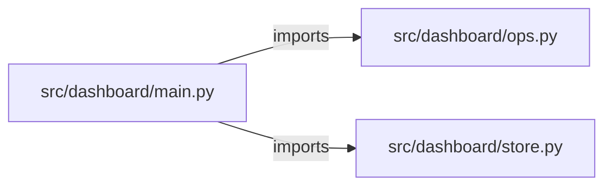

# fullstack-analytics-dashboard — project architecture

[README](README.md) · [Interview questions and answers](INTERVIEW_QA.md)

## Purpose and scope

React → FastAPI → SQLite → Docker. Auth, metric CRUD, filters, charts, OpenAPI `/docs`.

This document describes files and symbols in this checkout. Deployment templates and statements in the original overview are distinguished from a verified running environment.

## Component diagram



For Python repositories, arrows show resolved local imports, not network calls or deployment order. Otherwise the diagram is a repository component map; containment arrows do not assert runtime integration.

## Components and responsibilities

| Component | Responsibility |
| --- | --- |
| [`src/dashboard/main.py`](src/dashboard/main.py) | HTTP handlers: `GET /healthz`, `POST /login`, `POST /metrics`, `GET /metrics`, `GET /charts` |
| [`src/dashboard/ops.py`](src/dashboard/ops.py) | HTTP handlers: `GET /readyz`, `POST /workspaces`, `GET /workspaces`, `POST /workspaces/{workspace_id}/jobs`, `GET /jobs/{job_id}` |
| [`src/dashboard/store.py`](src/dashboard/store.py) | Functions: `init`, `_h`, `seed`, `token`, `user`, `login`, `add` |
| [`requirements.txt`](requirements.txt) | Implementation or supporting configuration |
| [`web/src/App.tsx`](web/src/App.tsx) | User interface code/assets |
| [`Dockerfile`](Dockerfile) | Container build/service configuration |
| [`Makefile`](Makefile) | Implementation or supporting configuration |
| [`docker-compose.yml`](docker-compose.yml) | Container build/service configuration |
| [`tests/test_dashboard.py`](tests/test_dashboard.py) | Executable checks and regression examples |
| [`tests/test_ops.py`](tests/test_ops.py) | Executable checks and regression examples |
| [`.github/workflows/ci.yml`](.github/workflows/ci.yml) | GitHub Actions job definitions |
| [`README.md`](README.md) | Project explanations or operating notes |
| [`docs/ARCHITECTURE.md`](docs/ARCHITECTURE.md) | Project explanations or operating notes |

## Existing design and operating guides

These checked-in guides provide the project’s detailed design, operational context, or deployment view:

- [`docs/ARCHITECTURE.md`](docs/ARCHITECTURE.md).

## Request interface

| Method and path | Handler | Source |
| --- | --- | --- |
| `GET /healthz` | `healthz` | [`src/dashboard/main.py`](src/dashboard/main.py#L17) |
| `POST /login` | `post_login` | [`src/dashboard/main.py`](src/dashboard/main.py#L21) |
| `POST /metrics` | `post_metric` | [`src/dashboard/main.py`](src/dashboard/main.py#L28) |
| `GET /metrics` | `get_metrics` | [`src/dashboard/main.py`](src/dashboard/main.py#L35) |
| `GET /charts` | `get_charts` | [`src/dashboard/main.py`](src/dashboard/main.py#L39) |
| `GET /readyz` | `readyz` | [`src/dashboard/ops.py`](src/dashboard/ops.py#L44) |
| `POST /workspaces` | `create_workspace` | [`src/dashboard/ops.py`](src/dashboard/ops.py#L49) |
| `GET /workspaces` | `list_workspaces` | [`src/dashboard/ops.py`](src/dashboard/ops.py#L66) |
| `POST /workspaces/{workspace_id}/jobs` | `create_job` | [`src/dashboard/ops.py`](src/dashboard/ops.py#L73) |
| `GET /jobs/{job_id}` | `get_job` | [`src/dashboard/ops.py`](src/dashboard/ops.py#L96) |
| `POST /jobs/{job_id}/approve` | `approve_job` | [`src/dashboard/ops.py`](src/dashboard/ops.py#L105) |
| `GET /audit` | `audit` | [`src/dashboard/ops.py`](src/dashboard/ops.py#L122) |
| `GET /metrics` | `metrics` | [`src/dashboard/ops.py`](src/dashboard/ops.py#L138) |

The table lists literal route decorators found in the inspected Python modules. Router prefixes and middleware can add behavior; check the linked handler and application setup before calling an endpoint.

## Implementation walkthrough

### `listing(owner, name=None, limit=20, offset=0)`

Source: [`src/dashboard/store.py`](src/dashboard/store.py#L46).

Calls visible in this function: `CONN.execute`, `CONN.execute('SELECT * FROM metrics WHERE owner=? AND name=? ORDER BY id DESC LIMIT ? OFFSET ?', (owner, name, limit, offset)).fetchall`, `CONN.execute('SELECT * FROM metrics WHERE owner=? ORDER BY id DESC LIMIT ? OFFSET ?', (owner, limit, offset)).fetchall`, `CONN.execute('SELECT COUNT(*) FROM metrics WHERE owner=? AND name=?', (owner, name)).fetchone`, `CONN.execute('SELECT COUNT(*) FROM metrics WHERE owner=?', (owner,)).fetchone`, `dict`, `int`, `max`, `min`.

```python
def listing(owner, name=None, limit=20, offset=0):
    limit, offset = max(1, min(int(limit), 100)), max(0, int(offset))
    if name:
        items = CONN.execute("SELECT * FROM metrics WHERE owner=? AND name=? ORDER BY id DESC LIMIT ? OFFSET ?", (owner, name, limit, offset)).fetchall()
        total = CONN.execute("SELECT COUNT(*) FROM metrics WHERE owner=? AND name=?", (owner, name)).fetchone()[0]
    else:
        items = CONN.execute("SELECT * FROM metrics WHERE owner=? ORDER BY id DESC LIMIT ? OFFSET ?", (owner, limit, offset)).fetchall()
        total = CONN.execute("SELECT COUNT(*) FROM metrics WHERE owner=?", (owner,)).fetchone()[0]
    return {"items": [dict(x) for x in items], "total": total, "limit": limit, "offset": offset}
```

### `user(tok)`

Source: [`src/dashboard/store.py`](src/dashboard/store.py#L26).

Calls visible in this function: `f'{email}|{exp}'.encode`, `hmac.compare_digest`, `hmac.new`, `hmac.new(SECRET, body, 'sha256').hexdigest`, `int`, `time.time`, `tok.split`.

```python
def user(tok):
    try:
        email, exp, sig = tok.split("|")
        body = f"{email}|{exp}".encode()
        if hmac.compare_digest(sig, hmac.new(SECRET, body, "sha256").hexdigest()) and int(exp) >= time.time():
            return email
    except (ValueError, TypeError):
        return None
```

### `current(authorization: str | None)`

Source: [`src/dashboard/main.py`](src/dashboard/main.py#L8).

Calls visible in this function: `HTTPException`, `authorization.removeprefix`, `authorization.removeprefix('Bearer ').strip`, `authorization.startswith`, `user`.

```python
def current(authorization: str | None):
    if not authorization or not authorization.startswith("Bearer "):
        raise HTTPException(401, "missing token")
    email = user(authorization.removeprefix("Bearer ").strip())
    if not email:
        raise HTTPException(401, "invalid token")
    return email
```

### `seed()`

Source: [`src/dashboard/store.py`](src/dashboard/store.py#L14).

Calls visible in this function: `CONN.commit`, `CONN.execute`, `CONN.execute("SELECT 1 FROM users WHERE email='ada@example.com'").fetchone`, `_h`, `init`, `os.urandom`.

```python
def seed():
    init()
    if CONN.execute("SELECT 1 FROM users WHERE email='ada@example.com'").fetchone():
        return
    salt = os.urandom(16)
    CONN.execute("INSERT INTO users VALUES (?,?,?)", ("ada@example.com", salt, _h("pass-ada", salt)))
    CONN.commit()
```

## Validation and failure paths

| Explicit exception | Source |
| --- | --- |
| `HTTPException(401, 'missing token')` | [`src/dashboard/main.py`](src/dashboard/main.py#L10) |
| `HTTPException(401, 'invalid token')` | [`src/dashboard/main.py`](src/dashboard/main.py#L13) |
| `HTTPException(401, 'bad credentials')` | [`src/dashboard/main.py`](src/dashboard/main.py#L24) |
| `HTTPException(422, 'name and numeric value required')` | [`src/dashboard/main.py`](src/dashboard/main.py#L31) |
| `HTTPException(status_code=404, detail='workspace not found')` | [`src/dashboard/ops.py`](src/dashboard/ops.py#L77) |
| `HTTPException(status_code=404, detail='job not found')` | [`src/dashboard/ops.py`](src/dashboard/ops.py#L100) |
| `HTTPException(status_code=404, detail='job not found')` | [`src/dashboard/ops.py`](src/dashboard/ops.py#L109) |
| `HTTPException(status_code=403, detail='production apply is disabled in this lab')` | [`src/dashboard/ops.py`](src/dashboard/ops.py#L113) |

These are explicit exceptions in the inspected source, rather than a claim that every failure is handled. Follow the calling handler to see whether the exception becomes an HTTP response or propagates.

## Data and state

- [`src/dashboard/ops.py`](src/dashboard/ops.py) defines module-level containers: `_WORKSPACES`, `_JOBS`, `_AUDIT`, `_METRICS`.

Module-level dictionaries/lists live in a Python process. They can be fixtures or mutable state; inspect writes before treating them as persistent storage. A production extension would need to define persistence and concurrency behavior explicitly.

## Data flow and design decisions

### What is the input-to-output contract of `listing`

In [`src/dashboard/store.py`](src/dashboard/store.py#L46), `listing(owner, name=None, limit=20, offset=0)` receives the inputs. The function computes these intermediate values:

- `limit, offset = (max(1, min(int(limit), 100)), max(0, int(offset)))`

Its result is defined by:

- `{'items': [dict(x) for x in items], 'total': total, 'limit': limit, 'offset': offset}`

### Which decision rules or boundary conditions should an interviewer challenge

The implementation in [`src/dashboard/store.py`](src/dashboard/store.py#L46) branches on:

- `name`

A useful extension is a table-driven test that covers each condition just below, at, and above its boundary where applicable. These expressions are the current rules; changing them changes behavior and should be justified by the project’s acceptance criteria.

### What does `web/src/App.tsx` own

[`web/src/App.tsx`](web/src/App.tsx) defines `App`.

Trace these definitions and imports to explain the module boundary. Relative imports identify project code; package imports should be checked against the nearest manifest.

### What does the operations plane add, and where is its limit

[`src/dashboard/ops.py`](src/dashboard/ops.py) declares `GET /readyz`, `POST /workspaces`, `GET /workspaces`, `POST /workspaces/{workspace_id}/jobs`, `GET /jobs/{job_id}`, `POST /jobs/{job_id}/approve`, `GET /audit`, `GET /metrics`. Inspect the application’s `include_router` call for its URL prefix.

Its state containers are `_WORKSPACES`, `_JOBS`, `_AUDIT`, `_METRICS`. The job-approval handler defines whether a target is accepted or refused; check that branch and the associated tests instead of treating a recorded job as a successful infrastructure apply.

## Setup and verification

The following commands are derived from the checked-in dependency/test contracts. Execute them from the repository root; the block prepares a local environment, not a cloud deployment.

```bash
python3 -m venv .venv
source .venv/bin/activate
python -m pip install -r requirements.txt
python -m pytest -q
```

Python dependencies: [`requirements.txt`](requirements.txt).

Test entry points: [`tests/test_dashboard.py`](tests/test_dashboard.py), [`tests/test_ops.py`](tests/test_ops.py).

Automation definitions: [`.github/workflows/ci.yml`](.github/workflows/ci.yml). Read their triggers and job steps to determine what CI actually runs.

## Operating boundaries and design review

Before turning this checkout into a customer deployment, establish the input contract, data ownership, access controls, failure response, evaluation criteria, and rollback owner. Repository fixtures and unit tests demonstrate local behavior; they do not establish throughput, uptime, compliance, or business impact.

A useful architecture review starts with the linked implementation: identify where input enters, where a decision is made, which state can change, and which external dependency can fail. Add a deployment view only for infrastructure that is actually configured and exercised.
